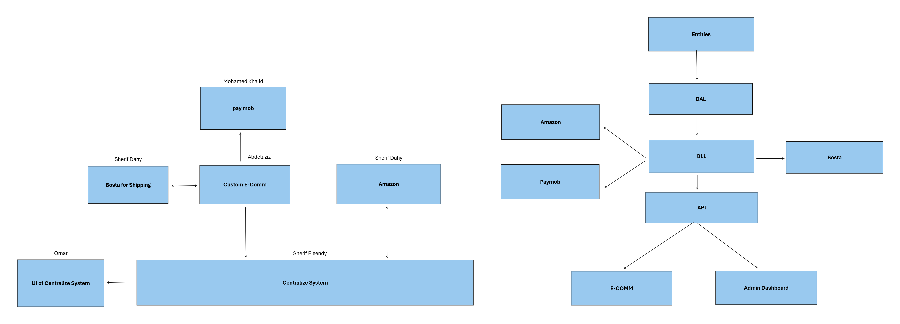
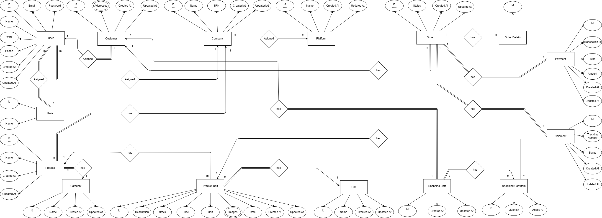

# 🐝 NewBee Team - Unified E-Commerce & Shipping Platform

## 📌 Project Idea
**Unified E-Commerce & Shipping Platform**  
A centralized platform that connects and integrates multiple e-commerce platforms (such as **Amazon**, **Jumia**, and custom stores) with shipping providers (such as **Bosta**) through a single, easy-to-use interface.

✅ Simplify order management  
✅ Track shipments  
✅ Update inventory  
✅ Improve business operations efficiency  

> The platform helps merchants save time, reduce errors, and increase productivity.

---

## 👥 Team Members
- **Sherif Mohamed Dahy** *(Team Leader)*  
- Omar Zaki Mohamed Zaki El-Sayed  
- Abdelaziz Ahmed Abdelaziz Mousa  
- Mohamed Khaled Mohamed Farag  
- Sherif Mohamed Mahmoud El-Gendy  

---

## ⚙️ How It Works
1. Merchant creates an account on the platform.  
2. Connects their e-commerce accounts (Amazon, Jumia, Custom E-Comm) and shipping providers (Bosta).  
3. Through a **centralized dashboard**, the merchant can:  
   - Manage all orders in one place.  
   - Track shipping statuses.  
   - Generate invoices.  
   - Access detailed analytical reports.  
4. Data is automatically synced across all integrated systems.  

---

## 🛠️ Tech Stack
- **Back-End:** ASP.NET Core Web API  
- **Front-End:** Angular + Bootstrap  
- **Database:** SQL Server  
- **Integration:** RESTful APIs & Webhooks  
- **Security:** JWT Authentication + Data Encryption  
- **Infrastructure:** Azure Cloud + Docker  

---

## 📷 Screenshots & Diagrams
Here are some visuals of the system:

### 📊 System Diagram

<!-- You can add more screenshots like this -->
<!--  -->
<!--  -->

---

## 🚀 Future Enhancements
- Support for electronic payment systems.  
- AI-powered sales data analytics.  

---

## 📫 About
This project was developed by **NewBee Team** as an innovative solution to unify e-commerce and shipping operations.

